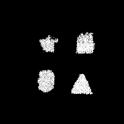
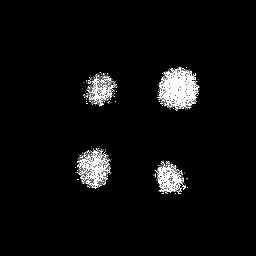
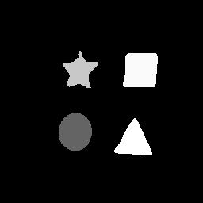

# Multiclass-Semantic-Segmentation-UNet_series-pytorch
Semantic-Segmentation-Multiclass_FCN_Unet_ResUnet(Multiclass)  
run train.py 執行train.py即可訓練  
run test.py   執行test.py即可使用所訓練的pt檔預測輸出，輸出目錄為dataset/result，檔名會新增_predict以辨識  
run eval.py   執行eval.py即可評估dataset/result內的輸出圖像跟ground trust圖像，將會在目錄輸出Model_Predict.txt，內含Average Pixel Accuracy | classPixelAccuracy | Average Mean Accuracy | Average Mean IU    
  
## **Implementation Details**  
Python 3.6  
Pytorch 1.8  
Cuda 10.2  
input images are resized to [256 ,256]   
Training was performed using Stochastic Gradient Descent (SGD) with learning rate 0.001    
輸入圖像被縮放至[256 ,256]   使用SGD，學習率0.001  

## **Use Model**  
+ [FCN8S](https://github.com/bat67/pytorch-FCN-easiest-demo)
+ [FCN32S](https://github.com/bat67/pytorch-FCN-easiest-demo)
+ [UNet](https://medium.com/analytics-vidhya/pytorch-implementation-of-semantic-segmentation-for-single-class-from-scratch-81f96643c98c)  
+ [UNet++](https://github.com/4uiiurz1/pytorch-nested-unet)
+ [ResUnet](https://github.com/galprz/brain-tumor-segmentation)  

## **Dataset**  
The dataset is divided into three parts: 160 images for the training set and 40 images for the validation set
The dataset is to segment 4 classes such as circle,square,triangle,star  
資料集被分為160張用來訓練，40張用來驗證，並且有4個類[circle,square,triangle,star]  
Their corresponding grayscale values are
|Class | Grayscale|
|---- | ----|
|circle | 100|
|square |  250|
|triangle |  255|
|star |  200| 
  
## **Result**  　　
|Model | Average Pixel Accuracy|Average Mean Accuracy|Circle Accuracy|Square Accuracy|Triangle Accuracy|Star Accuracy|Background Accuracy|
|---- | ----|----|---- | ----|----|----|----|
|FCN8S | 0.941|0.413|0.120|0.438|  0.186|0.323|0.998|
|FCN32S | 0.934|0.331|0.176|0.333|  0.036|0.112|0.998|
|UNet | 0.980|0.827|0.791|0.838|  0.733|0.775|0.996|
|UNet_Plus | 0.979|0.802|0.770|0.851|  0.694|0.696|0.997|
|ResUNet | 0.982|0.827|0.797|0.852|  0.687|0.800|0.998|

        
　　　　　Ground Trust 　　　　　　　　　　   　    FCN8S 　　　　　　　　　　   　 　 FCN32S

        
　　　　　 　 　UNet 　　　　　　　　　　   　      　UNet Plus 　　　　　　　　　　   　  ResUNet
